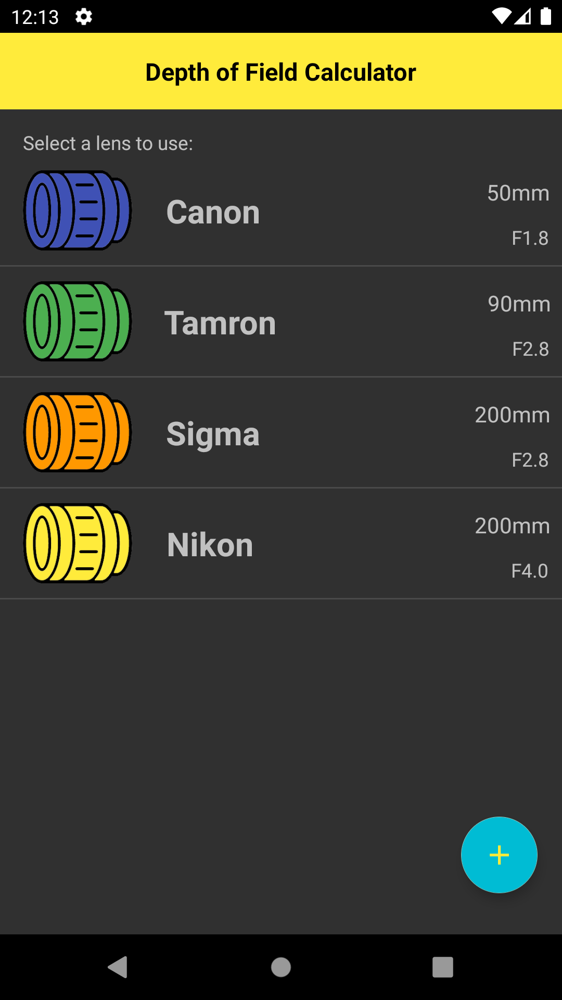
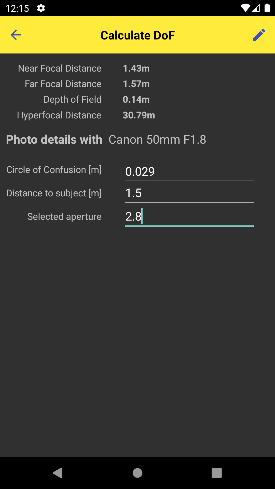
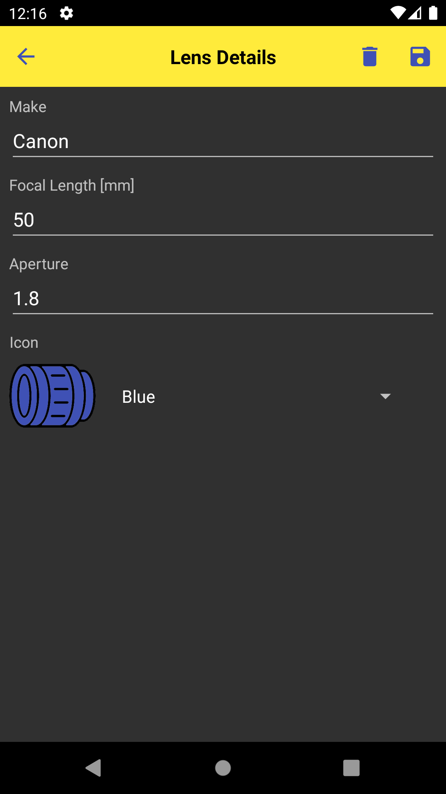

# Depth of Field Calculator Android App
<p align='center'>
  
</p>
Calculate the camera len's depth of field with this Android App calculator. 
Choose lens and enter valid aperture and distance to subject to start the calculator. 
It will output the focus distance range, depth of field distance, and hyperfocal point.

## Installation
1. Download, install, and run [Android Studios](https://developer.android.com/studio)
2. Click "Get From Version Control"
3. Insert the following URL:
```
https://github.com/Toooo123/Depth-of-Field-Calculator-Android.git
```
4. Run app on either an Android Emulator or your phone plugged into your computer

## Features
- Calculate Near and Far Focal Distance, Depth of Field and Hyperfocal distance with given Distance and selected Aperture
- Add your lens by putting the Make, Focal Length, and Aperture
- Choose one of five colours for the icon
- Edit existing lens to modify the numbers and make

## Screenshots
<table>
  <tr>
    <td>  </td>
    <td>  </td>
    <td>       </td>
  </tr>
  <tr>
    <td> Lens List Screen </td>
    <td> Calculating Depth of Field Screen </td>
    <td> Adding/Editing Lens Screen </td>
  </tr>
</table>

## Other
- [Text UI Version](https://github.com/Toooo123/Depth-of-Field-Calculator)
